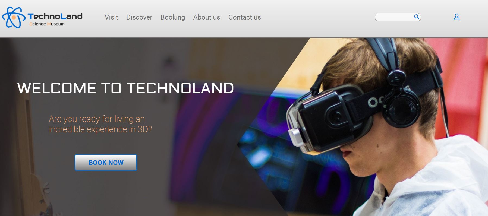

# Science Museum - 1 semester project

## Brief
An interactive science museum is opening in your town/city. Its core target audience is primary and middle school children (7-15) and families with young children. The museum wants a website that is informative and appealing, that will attract both middle school pupils and their parents. The site should appeal to youngsters without pandering; it should take for granted that the audience is inquisitive and intelligent. The website should be informative and engaging, but should encourage viewers to visit the museum itself. The website should be responsive and be easy to use on a variety of devices.

## Description
The project exam should reflect the student's creative and technical knowledge and skills based on the first semester curriculum. This includes design principles, project management, communication technology, and developing with HTML/CSS.

**Final Product:** 
- A fully responsive website which works on desktop, tablet and mobile.
- Create a PDF
- Please add sketches, style-tiles and a link to your Adobe XD design in the PDF
- List all of your image and code sources inside this PDF.
- Add your git repo link to this site PDF as well as a link to your site, which is deployed to netlify. 

## Requirements
- The site must have a design that appeals to the target audience.
- The site must have at least 4-6 pages.
- Compositional principles, typography, and color schemes must be considered.
- A project work plan should be included.
- Your HTML should be semantic and neatly indented.
- The site should use external CSS style sheets.
- The site should download quickly, and not be overly "heavy". Images should not be over 200kb.
- The site should take WCAG principles into consideration, especially regarding hierarchy, navigation, and color usage.
- The site should be responsive, attractive, and easy to use on a variety of devices.
- The site should show consideration for content strategy and SEO (consider your use of meta tags and alt text).
- A report containing: sketches, style-tiles and a link to your Adobe XD design in the PDF, a list of all of your images and code sources, your git repo link and a link to your site on netlify.

##  Built with

- HTML
- CSS

## Contact 

https://www.linkedin.com/in/mariano-david-franco-gallo/

